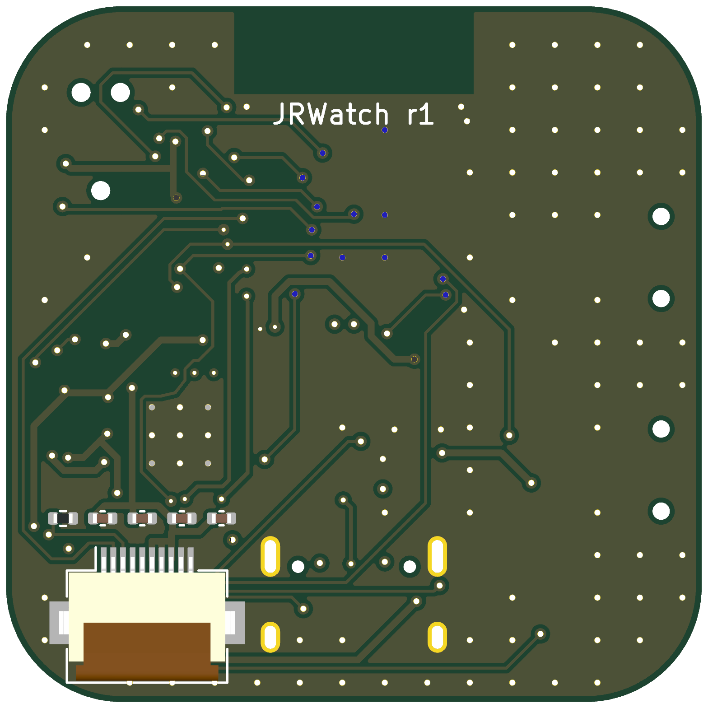
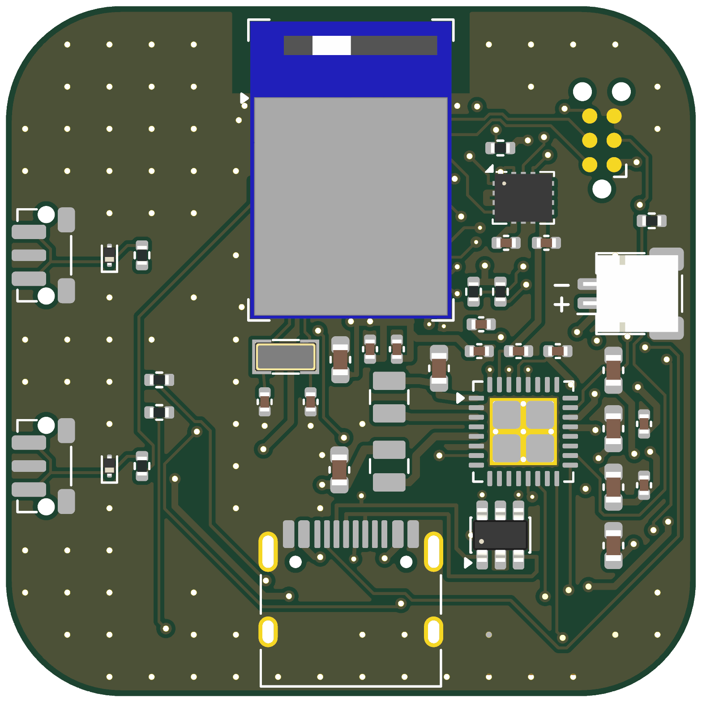

# JRWatch — Low-Power BLE Wearable

A 36 mm, 4-layer, wrist-wearable smartwatch board built end-to-end with a
**computer-aided automated design workflow**: schematic as code (SKiDL),
programmatic placement and routing (pcbnew scripting + autorouter +
raster-verified completion passes), scripted DRC/verification, and a Zephyr
firmware whose power states map 1:1 to the hardware's gated power domains.

  

| | |
|---|---|
| **Projected armed-sleep current** | **≈ 15 µA** (motion-wake armed, face displayed, BLE off) / ≈ 26 µA with slow advertising |
| **Projected battery life (150 mAh)** | **≈ 4–8 months per charge** typical use; ship mode 370 nA (cell self-discharge dominates) |
| Status | *projections from datasheet typicals — itemized in [the verification report](docs/verification-report.md); replaced by PPK2 measurements at bring-up* |

## Hardware

- **SoC/BLE**: Raytac MDBT50Q-1MV2 (nRF52840, certified chip antenna) — datasheet keep-out honored on all 4 layers
- **PMIC**: Nordic nPM1300 — LiPo charging (76 mA, NTC-protected), 3.0 V buck rail correct-by-hardware at power-on, two load-switched power domains, 370 nA ship mode
- **IMU**: Bosch BMI270 — 5.9 µA any-motion wake, SPI
- **Display**: Sharp LS013B7DH03 memory-in-pixel 128×128 — holds a static watch face at ~4 µA, no backlight
- **USB-C** charge + Full-Speed DFU, Tag-Connect SWD, two side buttons (one is the hardware ship-mode pin), 32.768 kHz crystal
- 36 × 36 mm, 4-layer 0.8 mm (JLCPCB JLC04081H-3313), every BOM line LCSC-verified with stock state recorded

| Top | Bottom |
|---|---|
|  |  |

## Verification highlights ([full report](docs/verification-report.md))

- ERC **0 errors / 0 warnings**; board DRC **zero violations**
- Antenna keep-out geometrically verified copper-free on all layers
- Charge path ≥ 2.5× IPC-2221 width at the 500 mA USB limit (calc shown)
- USB pair skew 7.0 mm ≈ 46 ps = 0.06 % of a Full-Speed bit (documented, not decorated)
- Sneak-leakage review: every pull idles at 0 µA by construction; gated rails quiesced before power-cut
- **Honest gap**: 7 links in the PMIC fan-out are deliberately unrouted with exact endpoints + fix recipes in the [review checklist](docs/human-review-checklist.md) — ~30 min of interactive routing gates the fab order

## Firmware ([firmware/](firmware/), [protocol](docs/protocol.md))

Zephyr (pinned v4.1.0), custom board definition pin-mapped from the SKiDL
source. Event-driven ACTIVE / armed-sleep / ship-mode tiers; display redrawn
only on content change; IMU interrupt wake; BLE Battery Service + custom
step-count GATT; RTT console (no UART pins spent). Built in CI with `west`.

## Repository

| Path | Contents |
|---|---|
| `hardware/skidl/` | Schematic as code (source of record) + ERC report |
| `hardware/scripts/` | Board build, placement, routing, completion, DRC, fab pipeline |
| `hardware/jrwatch.kicad_pcb` | The board (KiCad 10) |
| `fab/` | Gerbers, drill, BOM+CPL (JLC format), renders, order notes |
| `firmware/` | Zephyr app + custom board + CI |
| `docs/` | [Decision log](docs/decision-log.md) · [design rationale](docs/design-rationale.md) · [verification report](docs/verification-report.md) · [review checklist](docs/human-review-checklist.md) · [needs-input](docs/NEEDS-INPUT.md) · [BLE protocol](docs/protocol.md) |

## Next steps

1. Close the 7 documented links (checklist §1) and re-run DRC
2. Review checklist §3 (battery polarity, FPC reach, inductor land)
3. Order JLCPCB (parameters in [fab/README.md](fab/README.md)); hand-place U1/U2 from DigiKey
4. Bring-up: SWD flash → RTT logs → BLE + display + charge path
5. **Measure sleep current (PPK2) and replace every projection in this README and the verification report with the real numbers**

*All design work in this repository was produced with modern automated
design tooling; decisions and their reasoning are logged in
[docs/decision-log.md](docs/decision-log.md).*
