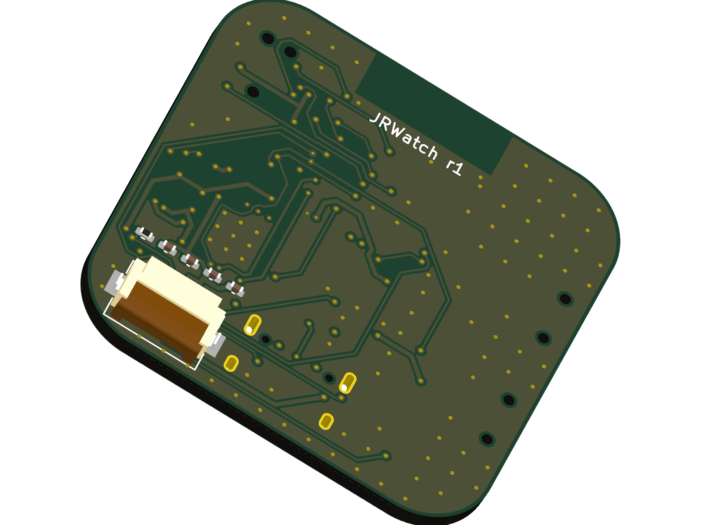

# JRWatch

A smartwatch I'm building from scratch: 36 mm 4-layer board with an nRF52840
BLE module, Nordic nPM1300 PMIC, Bosch BMI270 IMU, and a Sharp memory-in-pixel
display, plus Zephyr firmware. The goal was to see how low I could get the
sleep current on a real wearable, and to do the whole design flow as code
instead of clicking through an editor. The schematic is Python (SKiDL),
placement and most routing are scripted against the KiCad API, and the docs
record why every part and rule is what it is.

  

| | |
|---|---|
| Projected sleep current | **~15 µA** with motion wake armed and the watch face still showing (about 26 µA if it keeps advertising over BLE) |
| Projected battery life | **~4-8 months** on a 150 mAh cell, depending on use |
| Firmware | Zephyr v4.1.0, builds in CI: 231 KiB flash / 40 KiB RAM |

These are calculated from datasheet numbers, not measured yet. Every line of
the estimate is in the [verification report](docs/verification-report.md)
with its source, and the plan is to replace them with real PPK2 measurements
at bring-up.

## Why these parts

- **Raytac MDBT50Q-1MV2** (nRF52840 module): pre-certified with a tuned
  antenna. I don't have a VNA, so a hand-tuned trace antenna would quietly
  waste battery on retransmissions. The module keep-out zone is held on all
  four layers and I verified it's copper-free.
- **Nordic nPM1300**: one chip that does LiPo charging (with a real NTC on
  the board), two buck regulators, two load switches, USB-C detection, and a
  370 nA ship mode. The load switches are the trick for the sleep numbers:
  the display and IMU rails get physically cut, so nothing leaks.
- **Bosch BMI270**: 5.9 µA low-power accel mode with a hardware any-motion
  interrupt. The SoC sleeps and a wrist-raise wakes it up.
- **Sharp LS013B7DH03** memory-in-pixel LCD: it holds a static image at
  about 4 µA with no backlight. A normal TFT would blow the entire power
  budget on its own.
- The rail is 3.0 V because every chip on the board is happy there and it's
  set by a resistor strap, so the PMIC comes up correct before any firmware
  runs.

## What's verified so far

- Schematic ERC: 0 errors, 0 warnings. Board DRC: **zero violations**
  against JLCPCB's 4-layer rules.
- Every BOM line checked against LCSC part by part (found three wrong
  capacitor/resistor numbers doing this, which paid for the effort).
- Charge path width checked against IPC-2221 (2.5x margin at the 500 mA
  USB limit), USB pair skew measured at 46 ps (0.06% of a Full-Speed bit),
  ground islands stitched to the internal plane.
- PMIC pinout re-verified pin-by-pin against Nordic's datasheet table, and
  the module pin map matches the firmware devicetree exactly.

## Current status (honest version)

**Not ordered yet.** During a final review before ordering I read the Sharp
panel's mechanical drawing closely and found the display FPC connector was
placed where the panel's tail physically can't reach, and the pin order was
mirrored for the fold-under mounting (the fold flips the contact face, which
reverses the pin order the connector sees). The schematic and netlist are
fixed and re-verified; the connector's correct position is worked out and
checked against every mechanical obstacle (see D-025 in the
[decision log](docs/decision-log.md)). The re-route of that corner lives on
the `d025-layout-wip` branch and needs one more routing session before the
fab gate opens. Catching this before spending money is the whole reason the
review checklist exists.

## Repo layout

| Path | What's in it |
|---|---|
| `hardware/skidl/` | The schematic, as Python. This is the source of record |
| `hardware/scripts/` | Board build, placement, routing, and review scripts |
| `hardware/jrwatch.kicad_pcb` | The board (KiCad 10) |
| `hardware/enclosure/` | Printable case (OpenSCAD + STLs) |
| `fab/` | Gerbers, BOM/CPL in JLCPCB format, renders, order notes |
| `firmware/` | Zephyr app + custom board definition + CI |
| `docs/` | [Decision log](docs/decision-log.md), [design rationale](docs/design-rationale.md), [verification report](docs/verification-report.md), [review checklist](docs/human-review-checklist.md), [BLE protocol](docs/protocol.md) |

## Firmware

Custom Zephyr board pin-mapped straight from the schematic source. Three
power tiers (active / armed sleep / ship mode) that map 1:1 to the hardware
power domains. The display only redraws when content changes, the IMU wakes
the SoC on motion, and the console is RTT so no pins are wasted on UART.
BLE exposes the standard battery service plus a small custom step-count
service ([protocol](docs/protocol.md)).

## Next steps

1. Finish the display-connector re-route (D-025), re-run DRC
2. Order from JLCPCB (parameters in [fab/README.md](fab/README.md)),
   hand-solder the module and PMIC from DigiKey
3. Bring-up: SWD flash, RTT logs, then BLE / display / charging
4. Measure the real sleep current and replace every projection above

Built with a scripted, automated design workflow end to end; the decision
log records each choice and the reasoning behind it.
