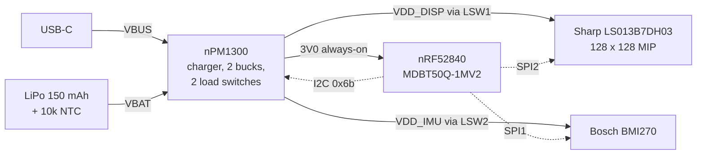
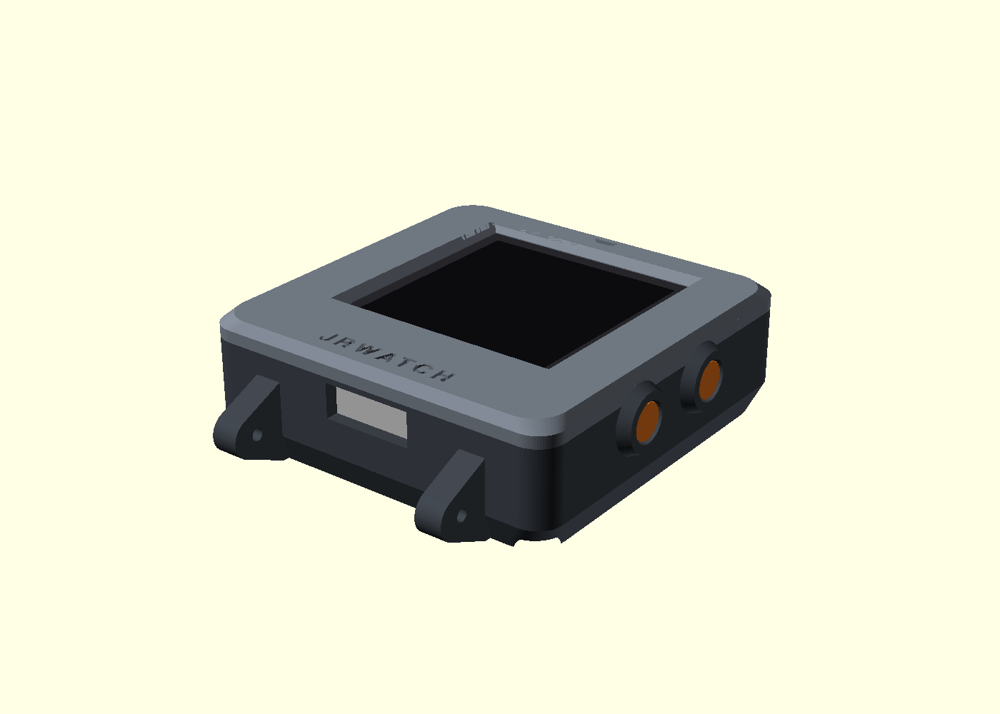

# JRWatch

A smartwatch I designed from scratch, circuit board included. It's 36 mm
across and 4 layers. An nRF52840 does the Bluetooth, an nPM1300 handles
charging and the power rails, and a BMI270 handles motion. The screen is
a Sharp memory-in-pixel LCD, which holds a static image on about 12 µW.
The code runs on Zephyr.

I spent most of this project chasing idle current, meaning how little it
draws while it's just sitting on your wrist.

  
  

Front of the board on the left, back on the right. 36 x 36 mm, 4 layers.

| | |
|---|---|
| Sleep current | about 15 µA, or 26 µA while it's advertising over Bluetooth (1.5 s interval, not connected) |
| Battery life | about 4 months if it's connected to a phone all day, 8 if it mostly just sits there, on a 150 mAh cell |
| Firmware | Zephyr v4.1.0, 232 KiB flash / 40 KiB RAM |

I worked these out from the datasheets, so they're estimates. I haven't
measured a real board yet. The math is all in the
[verification report](docs/verification-report.md). I wrote up the part
choices in the [design rationale](docs/design-rationale.md).

## How it's put together

```mermaid
flowchart LR
  USB["USB-C"]
  BAT["LiPo 150 mAh<br/>+ 10k NTC"]
  PMIC["nPM1300<br/>charger, 2 bucks,<br/>2 load switches"]
  MCU["nRF52840<br/>MDBT50Q-1MV2"]
  DISP["Sharp LS013B7DH03<br/>128 x 128 MIP"]
  IMU["Bosch BMI270"]

  USB -->|VBUS| PMIC
  BAT -->|VBAT| PMIC
  PMIC -->|3V0 always-on| MCU
  PMIC -->|VDD_DISP via LSW1| DISP
  PMIC -->|VDD_IMU via LSW2| IMU

  MCU -.->|I2C 0x6b| PMIC
  MCU -.->|SPI2| DISP
  MCU -.->|SPI1| IMU
```

Solid lines are power, dashed lines are data. The screen and the motion
sensor each sit behind a switch inside the power chip. While the watch is
idle they only pull about 4 µA and 6 µA. In ship mode the chip cuts the
battery off completely and the whole watch drops to 370 nA, low enough
that the cell's own self-discharge is what actually drains it. The full
parts list lives in
[`hardware/skidl/jrwatch.py`](hardware/skidl/jrwatch.py).

  

## Where it's at

I haven't had the board made yet. Before ordering I went back through
everything and found a problem with the connector the screen plugs into.
Both halves of it come from the same thing. The ribbon exits the middle
of the panel and has to fold 180 degrees back on itself underneath, and
that fold only leaves about a 9 mm window where the connector can go.
Mine wasn't in it. The fold also flips the contacts over, which reverses
the pin order, and I had them running straight through.

The pin order is fixed in the schematic. Moving the connector is a
layout change and that part isn't done, so ordering is on hold. It's
written up as D-025 in the [decision log](docs/decision-log.md).

I'd rather catch that on my screen than on a board I already paid for.

## Firmware

I wrote an out-of-tree Zephyr board port for it, devicetree and Kconfig
and all. There are three power modes. Awake, asleep but still watching
for motion, and fully off. The screen only redraws when something on it
changes, and the motion sensor wakes the chip when you lift your wrist.
Over Bluetooth it reports battery level and step count
([protocol](docs/protocol.md)).
