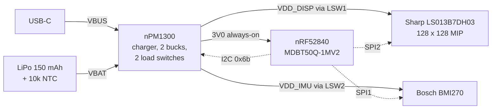

# JRWatch

A smartwatch designed from scratch, board included. 36 mm across and 4
layers, with an nRF52840 for Bluetooth, an nPM1300 handling charging and
the power rails, a BMI270 for motion, and a Sharp memory-in-pixel LCD
that holds a static image on about 12 µW. Firmware runs on Zephyr.

Most of the design work went into idle current, meaning what it draws
while sitting on a wrist doing nothing.

  
  

Front copper on the left, back on the right. 36 x 36 mm, 4 layers.

| | |
|---|---|
| Sleep current | ~15 µA, or ~26 µA while advertising over Bluetooth (1.5 s interval, not connected) |
| Battery life | ~4 months connected to a phone all day, ~8 months mostly idle, on a 150 mAh cell |
| Firmware | Zephyr v4.1.0, 232 KiB flash / 40 KiB RAM |

These are calculated from datasheet typicals, not measured on hardware.
The full itemization is in the
[verification report](docs/verification-report.md). Part choices are in
the [design rationale](docs/design-rationale.md).

## Architecture

```mermaid
flowchart LR
  USB["USB-C"]
  BAT["LiPo 150 mAh<br/>+ 10k NTC"]
  PMIC["nPM1300<br/>charger, 2 bucks,<br/>2 load switches"]
  MCU["nRF52840<br/>MDBT50Q-1MV2"]
  DISP["Sharp LS013B7DH03<br/>128 x 128 MIP"]
  IMU["Bosch BMI270"]

  USB -->|VBUS| PMIC
  BAT -->|VBAT| PMIC
  PMIC -->|3V0 always-on| MCU
  PMIC -->|VDD_DISP via LSW1| DISP
  PMIC -->|VDD_IMU via LSW2| IMU

  MCU -.->|I2C 0x6b| PMIC
  MCU -.->|SPI2| DISP
  MCU -.->|SPI1| IMU
```

Solid lines are power, dashed are data. The display and IMU sit behind
load switches inside the PMIC. In armed sleep they draw about 4 µA and
6 µA. Ship mode disconnects the battery entirely and the whole watch
drops to 370 nA, low enough that cell self-discharge dominates. Full net
list is in [`hardware/skidl/jrwatch.py`](hardware/skidl/jrwatch.py).

  

## Status

Not yet fabricated. A review before ordering turned up a problem with
the display connector, and both halves of it trace to one cause. The
panel's ribbon exits the center and has to fold 180 degrees back
underneath. That fold leaves roughly a 9 mm window where the connector
can sit, and mine was outside it. The fold also inverts the contact
face, which reverses the pin order, and I had the pins running straight
through.

The pin order is corrected in the schematic. Repositioning the connector
is a layout change and hasn't landed yet, so ordering is blocked.
Written up as D-025 in the [decision log](docs/decision-log.md).

## Firmware

An out-of-tree Zephyr board port with devicetree, Kconfig, and board
files. Three power modes cover active, armed sleep, and off. The display
redraws only when its content changes, and the IMU wakes the SoC on
motion. BLE reports battery level and step count
([protocol](docs/protocol.md)).
