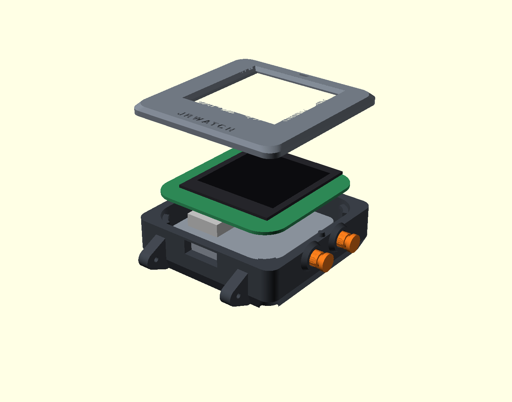
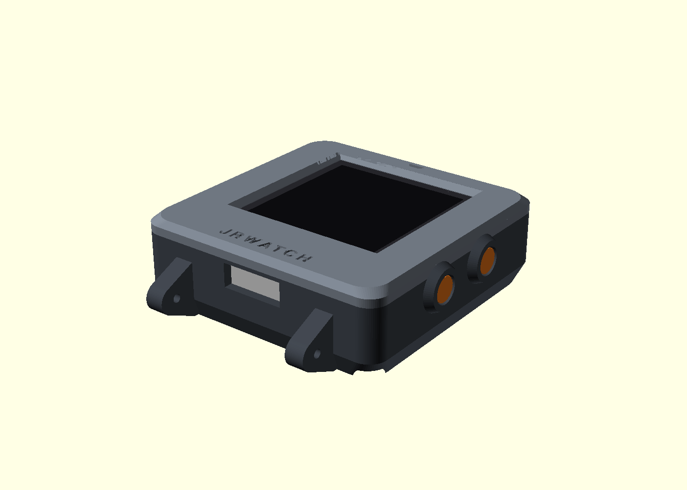
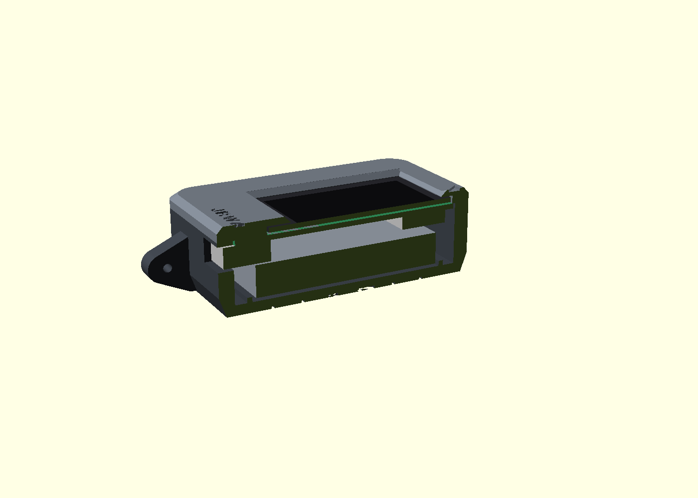
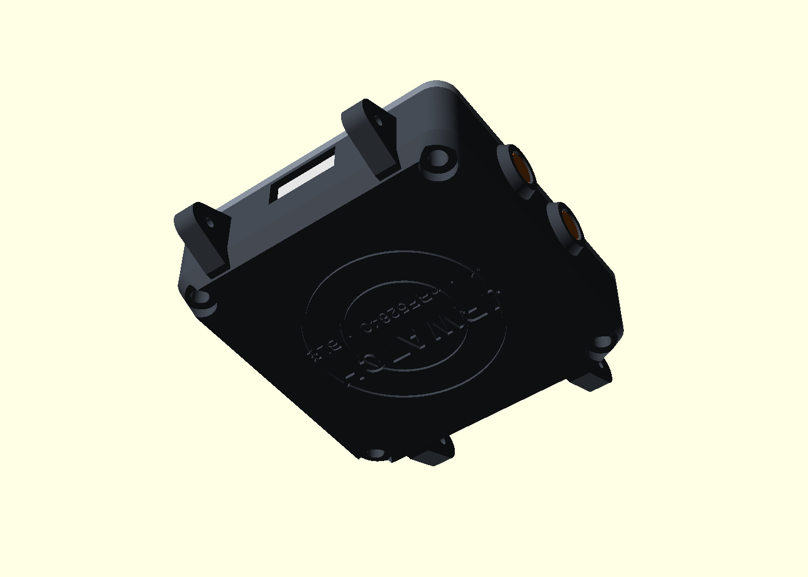

# Enclosure

Two-piece 3D-printable watch case, written as parametric OpenSCAD
(`jrwatch_case.scad`).
Every cutout is measured from the actual board file: the USB-C slot, the two
side-button bores, and the display aperture. The board has no mounting
holes, so the case clamps it at the four corner arcs, which I verified are
component-free on both sides.

| Exploded | Assembled |
|---|---|
|  |  |
| **Section through the USB slot** | **Case back** |
|  |  |

Tapered body with filleted edges, curved lugs drilled for 22 mm spring bars,
knurled sliding pushers in guarded pods, recessed USB-C port. Engraved
12-o'clock index, wordmark, and case back.

## Printed parts (`stl/`)

| File | Qty | What it is |
|---|---|---|
| `case-shell.stl` | 1 | Bottom shell: battery bay, component headroom, USB port, pusher pods, lug horns, engraved back |
| `case-bezel.stl` | 1 | Top ring: display pocket, FPC relief, chamfered aperture, index + wordmark |
| `case-button.stl` | 2 | Knurled sliding pushers (drop into the east-wall bores from the inside) |

Overall 41.4 × 41.4 × 13.6 mm plus lugs. Fits a 22 mm spring-bar strap.

## Ordering online

Upload the three STLs to any print service - [JLC3DP](https://jlc3dp.com)
(same account as the PCB order), Craftcloud, or Shapeways. Choose:

- **Process/material**: MJF or SLS, PA12 nylon (strong, accurate, no
  supports). Gray or dyed black. Expect roughly $5-15 for the set.
- Resin (SLA, "Tough" type) also works and looks smoother; avoid standard
  brittle resin for the lugs.
- FDM at home works if printed shell-open-side-up and bezel-top-down with
  supports in the USB slot; holes may need a 2 mm drill pass.

No metal-plated or metal-filled materials: the BLE antenna sits at the north
edge and the case must stay RF-transparent there.

## Other hardware

| Item | Spec | Note |
|---|---|---|
| Screws ×4 | M2 × 12 mm self-tapping, pan head | enter from the back, bite into the bezel |
| Spring bars ×2 | 22 mm, Ø1.3-1.5 tips | standard watch part |
| Strap | any 22 mm | |
| Display adhesive | 0.3 mm double-sided tape (3M 9448A or VHB) | frame the glass edges, keep the active area clear |
| Battery pad | 1-2 mm foam tape in the battery bay | |

## Assembly order

1. Drop the two button pins into the east-wall bores, flange inward.
2. Battery (502030, PCM-protected) into the bay, pad under it, pigtail up
   to J3 - **check polarity with a meter first** (board silk marks + / −).
3. Board in, components down, USB-C aligned to the south slot. It seats on
   the four corner pads.
4. Fold the display FPC into J2 (contacts down, flip the latch), tape the
   panel onto the board top with the tail at the south edge.
5. Bezel on, 4 screws from the back. Don't overtighten - stop at contact
   plus a quarter turn.

## Regenerating

```
openscad -D 'PART="shell"'  -o stl/case-shell.stl  jrwatch_case.scad
openscad -D 'PART="bezel"'  -o stl/case-bezel.stl  jrwatch_case.scad
openscad -D 'PART="button"' -o stl/case-button.stl jrwatch_case.scad
```

All key dimensions (stack heights, clearances, lug size) are parameters at
the top of the file.
